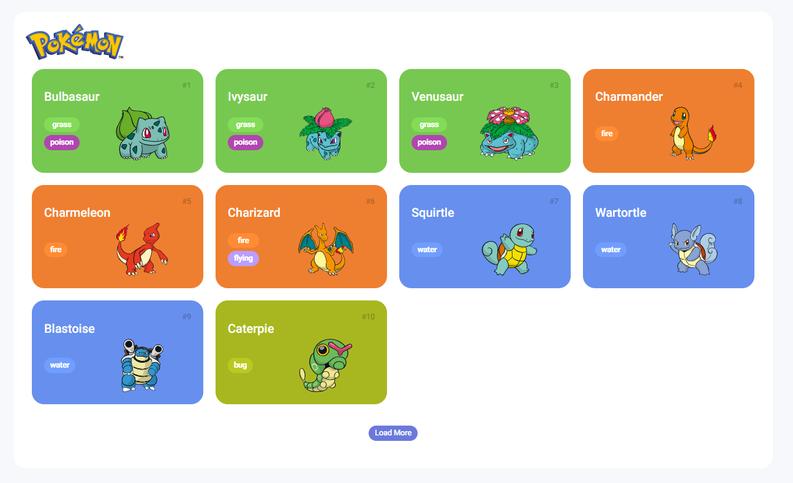

<h1 align="center"> POKEDEX </h1>

<h4 align="center"><a href="https://vini-pokedex.netlify.app/" target="_blank" >Confira o projeto aqui</a></h4>

#### Site foi desenvolvido junto ao Bootcamp da DIO com parceria do Banco Santander
#### nele eu pude aprender novas técnicas e aperfeiçoar o que já tinha conhecimento

## Tecnologias usada:

- HTML
- CSS
- Javascript
- Consumo de API (PokeAPI)

by [Vinicius Cordeiro]
